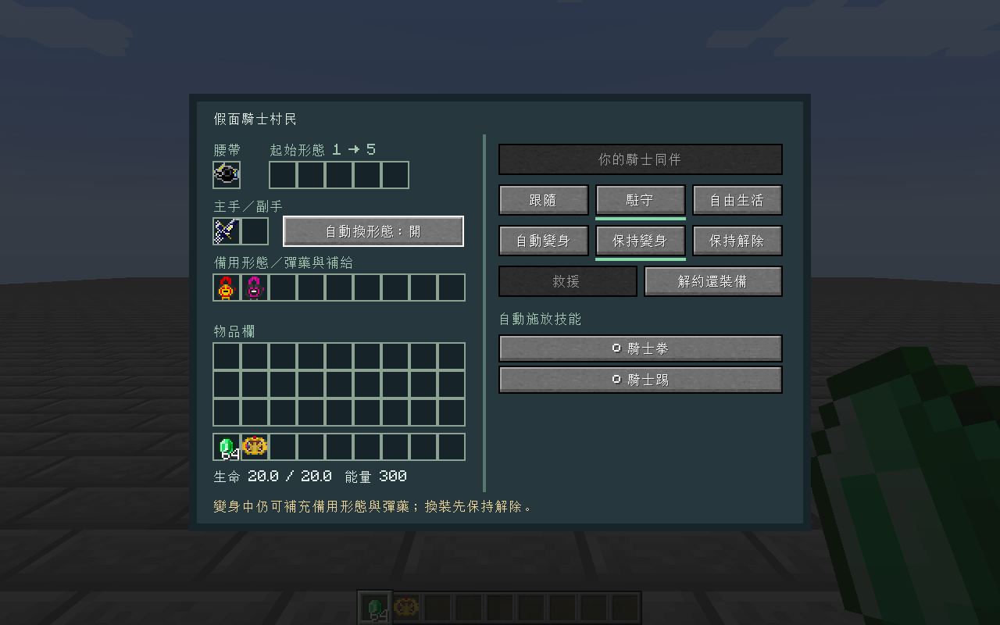
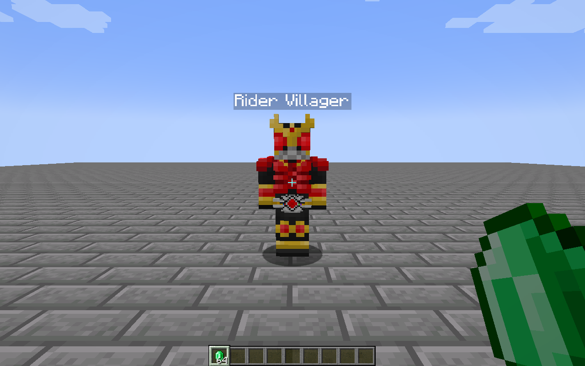

# 假面騎士村民 / KRC Villagers

[](https://github.com/win10ogod/krc-villagers/actions/workflows/build.yml)

假面騎士工藝（Kamen Rider Craft）的附屬模組。招募原版村民、交付腰帶和形態道具，讓村民使用通用變身的動畫與騎士拳／踢，並依目前形態施放技能。

**Shift＋右鍵開啟村民管理；普通右鍵仍是原版交易。**



## 安裝

適用 **Minecraft 1.21.1、NeoForge 21.1.244、Java 21**。從 [GitHub Releases](https://github.com/win10ogod/krc-villagers/releases) 下載 `krc-villagers-<版本>.jar`，放進遊戲實例的 `mods` 資料夾；多人遊戲的伺服器和每位玩家都要安裝。

以下是 **1.1.0 的測試組合**。自動更新發布的版本，請以該 Release 的依賴下載表與隨附 `dependencies.lock.json` 為準；每次更新都需重新通過編譯及遊戲測試。

| 模組 | 版本／檔案 |
| --- | --- |
| Kamen Rider Craft | `kamenridercraft-1.1.4.jar` |
| 通用變身 Generic Henshin | 0.1.139，`generic_henshin-cf8893780.jar` |
| GeckoLib | `geckolib-neoforge-1.21.1-4.9.3.jar` |
| Player Animation Library | `PlayerAnimationLibNeoforge-1.1.6+mc.1.21.1.jar` |
| Player Animator | `player-animation-lib-forge-2.0.4+1.21.1.jar` |
| Mob Player Animator | `mobplayeranimator-neoforge-1.21.1-1.4.0.jar` |
| Time Stop Clock | `timeclock-4.7.0-neoforge-1.21.1.jar` |
| Cloth Config | `cloth-config-15.0.140-neoforge.jar` |

兩個 Player Animation 模組具有不同的 mod ID，分別供 KRC 與通用變身使用，這組版本需要兩者。依賴檔案的 SHA-256 收錄於 [dependencies.lock.json](dependencies.lock.json)。發行 JAR 和原始碼壓縮包不內嵌其他模組。

## 操作

1. 對成年村民 **Shift＋右鍵**，花費 **8 顆綠寶石**招募。創造模式免收費，招募人數不設上限。
2. 把真正的 KRC 腰帶放進「腰帶」欄。腰帶已安裝的形態會保留；指定起始形態時，將形態道具放進它對應的 **1～5 號插槽**。例如 W 的兩枚記憶體需使用相應槽位。
3. 主手、副手可交付裝備，解除變身後仍持有武器。把其他形態、前置物品、弓／弩的箭矢放進「備用形態／彈藥與補給」；這九格可容納多個同槽位的形態，也可在變身中補充。容器、束口袋內的形態及必要物品也會檢查。
4. 選擇行為與變身方式。「自動換形態」預設開啟，依受傷、敵人、水中及著火狀態選擇持有的相容形態；遵守前置形態、道具和形態鎖，不消耗形態道具，每次換形態至少間隔 5 秒。關閉後保留目前形態。點擊技能前面的勾選鈕，可逐項啟用或停用自動施放。
5. 要更換腰帶、起始形態或手持裝備，先選 **「保持解除」**。解約會返還交付的物品；背包放不下時掉落在玩家身旁。

| 行為 | 效果 |
| --- | --- |
| 跟隨 | 跟隨招募者；同維度距離超過 32 格時尋找有實體地面的可站立位置傳送。招募者離線時就地駐守。 |
| 駐守 | 以選擇模式時的位置為中心，預設保護半徑 16 格。 |
| 自由生活 | 無戰鬥時交回原版村民 Brain，恢復工作與作息；附近有敵人時仍會防衛。 |

| 變身方式 | 效果 |
| --- | --- |
| 自動變身 | 發現敵人時變身；受傷且有可用回血形態時也會變身回血。戰鬥結束滿 20 秒且不再需要回血時解除。 |
| 保持變身 | 裝備、前置道具有效時維持變身。 |
| 保持解除 | 解除變身，開放調整裝備。村民仍可使用近戰或遠程武器防衛。 |

只有招募者能修改行為、取放裝備、救援和解約。普通村民的 UUID、職業、交易、等級及原有裝備均保留；資料寫入原村民的存檔。

## 戰鬥與技能

- 預設搜尋 24 格內可見的敵對生物，另辨識正在攻擊村民／招募者的生物。排除玩家、其他村民、已馴服生物與同隊實體；中立生物需處於敵對狀態。
- 交易預覽和耕作展示不再覆蓋交付的武器；武器在變身、解除、倒地和重載之間保留，正常耐久消耗與損壞照常。
- 原版弓／弩使用副手或補給欄的彈藥，保留原生投射物、附魔和耐久。KRC `BaseBlasterItem` 與 `NeoBaseBlasterItem` 槍械使用原模組彈體和射擊參數；新式槍械的彈匣與裝填時間分別保存在每把武器，不互相搶用全域狀態。射程內停步射擊，友方擋在射線上時停火。
- 落水時優先浮起、尋找附近可到達的乾燥岸邊，暫停追敵；原本設在水中的駐守點會移至上岸處。沒有可達岸邊時繼續浮水，不額外贈送水下呼吸效果。
- 裝甲再生效果依原效果強度回血，不再每刻重設週期。鎧武等裝甲的「飽和」效果另外接上村民回血：持續穿戴時每 10 刻回復 1 點生命，遵守 `naturalRegeneration` 規則；沒有回血效果的裝甲不獲得額外回血，解除後停止。
- 變身後以人形骨架顯示完整 KRC 裝甲，依 GH 的騎士時間設定播放變身動畫，保留原 KRC 的裝甲特效與形態效果。
- 通用騎士拳、騎士踢由 **GH 的生物技能 AI** 判斷時機、距離、目標血量和冷卻，使用 KRC 原技能造成傷害。預設 GH 額外施放間隔為 400 刻，敵人低於 50% 生命時才進入騎士踢條件；因此不會每次普攻都釋放必殺。
- 讀取當前形態在 KRC 的兩個技能欄，按戰況使用原技能，包括特殊拳／踢、炮擊、格林機槍、巨大化、縮小化、空間跳躍等。原 KRC 對魚類補給、空間跳躍的玩家限制，以及 1.1.4 的縮小化 dispatch 缺漏，在本附屬模組內補上村民執行路徑。魚類補給的原效果是生成魚，並非直接回血。
- **Clock Up**：使用原 KRC 加速能力並接上 GH 的 140 刻時間減速；原 KRC 起手要求 100 能量，成功後按 GH 結算為淨消耗 50。施放鎖解除後可在加速期間使用騎士踢。
- **Faiz Axel**：進入對應形態時觸發 GH 的 200 刻加速，可在管理介面停用。
- **時停**：使用 GH 的腰帶／形態識別及 Time Stop Clock，持續 120 刻，一般消耗 100 能量；Ohma Zi-O Driver 免消耗。兩次充能用盡後鎖定 400 刻。其他角色正在操作全域時間時不搶占；解除、倒地及卸載會清理村民自己的時間操作。
- 招募時初始化能量；之後按 KRC 原規則消耗與回復，不在每次施放前補滿能量。停用、缺少能量或啟動失敗均不額外扣能量。
- 致命傷改為 **倒地**，裝備保留。招募者花費 **4 顆綠寶石**救援，恢復一半生命。倒地時停止戰鬥；管理員的 `/kill` 仍保留原版強制刪除語意。



## 設定

第一次載入後，修改遊戲實例／伺服器的 `config/krc_villagers-server.toml`；本次 NeoForge 21.1.244 實測生成於此位置。多人遊戲使用伺服器設定：

```toml
recruitCost = 8
rescueCost = 4
detectionRange = 24
guardRadius = 16
calmTicks = 400
```

通用騎士拳／踢沿用通用變身自己的設定，包含 `mobSkillsEnabled`、距離、血量門檻及冷卻。若 GH 設定停用了生物技能，需要先開啟該設定。村民跟隨在目前維度執行，不會自動載入遠處區塊或跨維度搬移。

## 編譯與開發

安裝 Java 21 與 Python 3.11 以上；Gradle wrapper 會使用 Java 21 toolchain，也可自動取得編譯用 JDK。執行以下指令，會從 CurseForge 官方 CDN 與 Modrinth 自動下載鎖定版本，並驗證每個檔案的 SHA-256，不需要 API 金鑰：

```bash
python scripts/import-dependencies.py --download
```

本版測試組合的 KRC 為 [1.1.4／檔案 8869063](https://www.curseforge.com/minecraft/mc-mods/kamen-rider-craft/files/8869063)；通用變身為 [0.1.139 的 v316 kickmode-icon-bladesfix 版本／檔案 8893780](https://www.curseforge.com/minecraft/mc-mods/generic-henshin/files/8893780)，下載後存為專案使用的 `generic_henshin-cf8893780.jar`。下載腳本依目前鎖定檔取得版本，不會自行更新鎖定檔或覆蓋不同雜湊的既有檔案。原始下載網址與版本頁均記錄於 [dependencies.lock.json](dependencies.lock.json)。

也可手動把 KRC 與 GH 的上述 JAR 放在專案根目錄，其他依賴放在 `libs/`。

可從既有模組包複製符合雜湊的依賴，來源資料夾不會被修改：

```bash
python scripts/import-dependencies.py --from "你的 Minecraft 實例/mods"
python scripts/import-dependencies.py
```

Windows：

```powershell
.\gradlew.bat build runGameTestServer sourceZip
```

Linux／WSL：

```bash
bash gradlew build runGameTestServer sourceZip
```

成品在 `build/libs/`；完整專案壓縮包在 `build/distributions/`。`*-sources.jar` 是開發用原始碼，安裝遊戲只需要一般 JAR。

## 依賴自動更新、編譯與發布

[Build and release 工作流](https://github.com/win10ogod/krc-villagers/actions/workflows/build.yml) 每 **6 小時**檢查八個依賴模組的更新，排程為 UTC `00:23 / 06:23 / 12:23 / 18:23`，台灣時間 `08:23 / 14:23 / 20:23 / 02:23`；GitHub 排程可能延後。也可選擇 **Run workflow → main**，保留 `check_updates` 勾選，立即檢查、編譯並發布。

1. 查詢適用 **Minecraft 1.21.1 與 NeoForge** 的新檔案。比較 CurseForge 檔案 ID、Modrinth 發布 ID 與日期，因此相同版本號重新上傳也可辨識。Minecraft、NeoForge、Java 本身維持目前版本。
2. 在 runner 的候選工作目錄下載新 JAR，驗證上游提供的雜湊、實際 mod ID 與版本，重算 SHA-256，再更新 `dependencies.lock.json`；同一批依賴更新只將本模組修訂版號遞增一次，例如 `1.0.0 → 1.0.1`。
3. 執行下載／更新／發布程式的回歸測試，以及 `build runGameTestServer sourceZip`。全部成功後，由發布工作提交新的鎖定檔與版號到 `main`，自動建立 `v<版本>` 正式 Release。
4. Release 提供可安裝 JAR、sources JAR、完整專案 ZIP、SHA-256 校驗檔，以及此次精確的依賴下載連結。Release 附件沒有 Actions artifact 的 30 天到期限制。

沒有新檔案時，排程只完成檢查，不產生重複版本。查詢、下載、編譯或 GameTest 失敗時，工作流會標示失敗，現有鎖定檔及可用 Release 保留；上游 Java／Mixin 介面改變導致的不相容，需要修正附屬模組後才能發布。測試期間 `main` 若已有新提交，候選更新也不會覆蓋它，下一次檢查會以新提交重試。

KRC 與通用變身預設使用 [CFWidget 公開索引](https://cfwidget.com/) 查詢 CurseForge 檔案，再從 **CurseForge 官方 CDN** 下載。CFWidget 是第三方快取索引，資料可能晚於上游；若索引比鎖定檔舊，會明確記錄警告並保留較新的已鎖定檔案。若已取得 CurseForge API 金鑰，可加到倉庫的 Actions secret `CURSEFORGE_API_KEY`，改用 [CurseForge 官方 API](https://docs.curseforge.com/rest-api/)；不設金鑰仍可執行。其餘六個模組使用 Modrinth 官方 API。

更新頻道記錄在鎖定檔的 `update.channel`：預設正式版；原本就是 beta 的 Player Animator 保留 beta／正式版追蹤。每個發布 JAR 的直接相依版本會由鎖定檔產生，請配合該 Release 指定的檔案安裝。

普通 push 與 PR 也會編譯測試；`main` 成功後自動發布 `dev-<run ID>` 開發預覽版，PR 不發布。推送與 `mod_version` 一致的版本標籤，例如 `v1.0.0`，則自動發布正式版。已發布的版本不覆寫；中斷留下的同提交草稿可由重新執行發布工作補齊附件。所有發布均使用同次成功建置的成品，發布工作不重新編譯。

遊戲測試必須全部通過；Gradle 會比對測試程式中的項目數與伺服器的成功結果，缺少測試結果也會使工作流失敗。目前共 37 項 GameTest。工作流不執行圖形介面測試，客戶端驗證使用下方 `runClient -PuiSmoke`。

登入 GitHub，開啟成功的執行紀錄，在 **Artifacts** 下載 `krc-villagers-<commit SHA>`。壓縮檔包含：

- `libs/`：可安裝的模組 JAR 與開發用 sources JAR。
- `distributions/`：包含工作流與下載腳本的完整專案原始碼 ZIP。
- `SHA256SUMS.txt`：本次成品的 SHA-256。

Actions 成品保留 30 天；另有保留 14 天的 `diagnostics-<commit SHA>`，供查看編譯、GameTest 日誌、更新清單與錯誤報告。第三方依賴不包入成品。平常安裝可直接使用 Releases 的 JAR。

## 開發客戶端

`runClient` 可啟動開發客戶端。`runClient -PuiSmoke` 執行隔離的測試世界流程並產生 `evidence/` 截圖；此參數使用測試模組，測試程式不會進入發行 JAR。Linux 無桌面環境可用 `xvfb-run -a bash gradlew runClient -PuiSmoke`。

驗證範圍、實際輸出與相容細節見 [測試與相容報告](docs/verification.md)。
