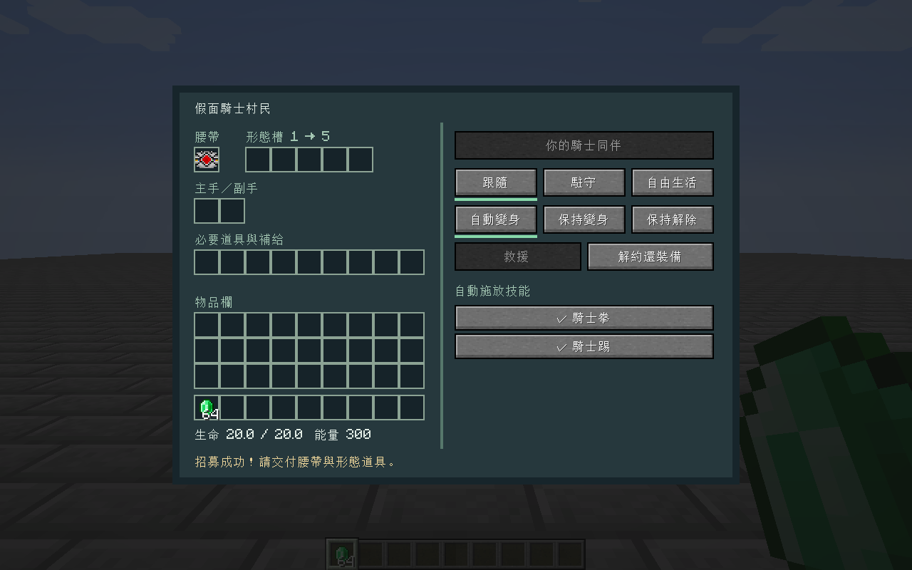

# 假面騎士村民 / KRC Villagers

假面騎士工藝（Kamen Rider Craft）的附屬模組。招募原版村民、交付腰帶和形態道具，讓村民使用通用變身的動畫與騎士拳／踢，並依目前形態施放技能。

**Shift＋右鍵開啟村民管理；普通右鍵仍是原版交易。**



## 安裝

適用 **Minecraft 1.21.1、NeoForge 21.1.244、Java 21**。將 `krc-villagers-1.0.0.jar` 放進遊戲實例的 `mods` 資料夾；多人遊戲的伺服器和每位玩家都要安裝。

本專案已使用以下版本編譯及測試。KRC、通用變身、Mob Player Animator 的相容介面綁定這些版本。

| 模組 | 版本／檔案 |
| --- | --- |
| Kamen Rider Craft | `kamenridercraft-1.1.4.jar` |
| 通用變身 Generic Henshin | 0.1.139，`generic_henshin-cf8875273.jar` |
| GeckoLib | `geckolib-neoforge-1.21.1-4.9.2.jar` |
| Player Animation Library | `PlayerAnimationLibNeoforge-1.1.6+mc.1.21.1.jar` |
| Player Animator | `player-animation-lib-forge-2.0.4+1.21.1.jar` |
| Mob Player Animator | `mobplayeranimator-neoforge-1.21.1-1.4.0.jar` |
| Time Stop Clock | `timeclock-4.7.0-neoforge-1.21.1.jar` |
| Cloth Config | `cloth-config-15.0.140-neoforge.jar` |

兩個 Player Animation 模組具有不同的 mod ID，分別供 KRC 與通用變身使用，這組版本需要兩者。依賴檔案的 SHA-256 收錄於 [dependencies.lock.json](dependencies.lock.json)。發行 JAR 和原始碼壓縮包不內嵌其他模組。

## 操作

1. 對成年村民 **Shift＋右鍵**，花費 **8 顆綠寶石**招募。創造模式免收費，招募人數不設上限。
2. 把真正的 KRC 腰帶放進「腰帶」欄。腰帶已安裝的形態會保留；需要換形態時，將形態道具放進它對應的 **1～5 號插槽**。例如 W 的兩枚記憶體需使用相應槽位。
3. 主手、副手可交付裝備；形態要求額外持有的物品放進「必要道具與補給」。容器、束口袋內的必要物品也會檢查。
4. 選擇行為與變身方式。點擊技能前面的勾選鈕，可逐項啟用或停用自動施放。
5. 要更換裝備，先選 **「保持解除」**。解約會返還交付的物品；背包放不下時掉落在玩家身旁。

| 行為 | 效果 |
| --- | --- |
| 跟隨 | 跟隨招募者；同維度距離超過 32 格時尋找有實體地面的可站立位置傳送。招募者離線時就地駐守。 |
| 駐守 | 以選擇模式時的位置為中心，預設保護半徑 16 格。 |
| 自由生活 | 無戰鬥時交回原版村民 Brain，恢復工作與作息；附近有敵人時仍會防衛。 |

| 變身方式 | 效果 |
| --- | --- |
| 自動變身 | 發現敵人時變身，脫離戰鬥 20 秒後解除。 |
| 保持變身 | 裝備、前置道具有效時維持變身。 |
| 保持解除 | 解除變身，開放調整裝備。村民仍可普通近戰防衛。 |

只有招募者能修改行為、取放裝備、救援和解約。普通村民的 UUID、職業、交易、等級及原有裝備均保留；資料寫入原村民的存檔。

## 戰鬥與技能

- 預設搜尋 24 格內可見的敵對生物，另辨識正在攻擊村民／招募者的生物。排除玩家、其他村民、已馴服生物與同隊實體；中立生物需處於敵對狀態。
- 變身後以人形骨架顯示完整 KRC 裝甲，依 GH 的騎士時間設定播放變身動畫，保留原 KRC 的裝甲特效與形態效果。
- 通用騎士拳、騎士踢由 **GH 的生物技能 AI** 判斷時機、距離、目標血量和冷卻，使用 KRC 原技能造成傷害。預設 GH 額外施放間隔為 400 刻，敵人低於 50% 生命時才進入騎士踢條件；因此不會每次普攻都釋放必殺。
- 讀取當前形態在 KRC 的兩個技能欄，按戰況使用原技能，包括特殊拳／踢、炮擊、格林機槍、巨大化、縮小化、空間跳躍等。原 KRC 對魚類補給、空間跳躍的玩家限制，以及 1.1.4 的縮小化 dispatch 缺漏，在本附屬模組內補上村民執行路徑。魚類補給的原效果是生成魚，並非直接回血。
- **Clock Up**：使用原 KRC 加速能力並接上 GH 的 140 刻時間減速；原 KRC 起手要求 100 能量，成功後按 GH 結算為淨消耗 50。施放鎖解除後可在加速期間使用騎士踢。
- **Faiz Axel**：進入對應形態時觸發 GH 的 200 刻加速，可在管理介面停用。
- **時停**：使用 GH 的腰帶／形態識別及 Time Stop Clock，持續 120 刻，一般消耗 100 能量；Ohma Zi-O Driver 免消耗。兩次充能用盡後鎖定 400 刻。其他角色正在操作全域時間時不搶占；解除、倒地及卸載會清理村民自己的時間操作。
- 招募時初始化能量；之後按 KRC 原規則消耗與回復，不在每次施放前補滿能量。停用、缺少能量或啟動失敗均不額外扣能量。
- 致命傷改為 **倒地**，裝備保留。招募者花費 **4 顆綠寶石**救援，恢復一半生命。倒地時停止戰鬥；管理員的 `/kill` 仍保留原版強制刪除語意。


## 設定

第一次載入後，修改遊戲實例／伺服器的 `config/krc_villagers-server.toml`；本次 NeoForge 21.1.244 實測生成於此位置。多人遊戲使用伺服器設定：

```toml
recruitCost = 8
rescueCost = 4
detectionRange = 24
guardRadius = 16
calmTicks = 400
```

通用騎士拳／踢沿用通用變身自己的設定，包含 `mobSkillsEnabled`、距離、血量門檻及冷卻。若 GH 設定停用了生物技能，需要先開啟該設定。村民跟隨在目前維度執行，不會自動載入遠處區塊或跨維度搬移。

## 編譯與開發

安裝 Java 21；Gradle wrapper 會使用 Java 21 toolchain，也可自動取得編譯用 JDK。把 KRC 與 GH 的上述 JAR 放在專案根目錄，其他依賴放在 `libs/`。

可從既有模組包複製符合雜湊的依賴，來源資料夾不會被修改：

```bash
python scripts/import-dependencies.py --from "你的 Minecraft 實例/mods"
python scripts/import-dependencies.py
```

Windows：

```powershell
.\gradlew.bat build runGameTestServer sourceZip
```

Linux／WSL：

```bash
bash gradlew build runGameTestServer sourceZip
```

成品在 `build/libs/`；完整專案壓縮包在 `build/distributions/`。`*-sources.jar` 是開發用原始碼，安裝遊戲只需要一般 JAR。

`runClient` 可啟動開發客戶端。`runClient -PuiSmoke` 執行隔離的測試世界流程並產生 `evidence/` 截圖；此參數使用測試模組，測試程式不會進入發行 JAR。Linux 無桌面環境可用 `xvfb-run -a bash gradlew runClient -PuiSmoke`。

驗證範圍、實際輸出與相容細節見 [測試與相容報告](docs/verification.md)。
